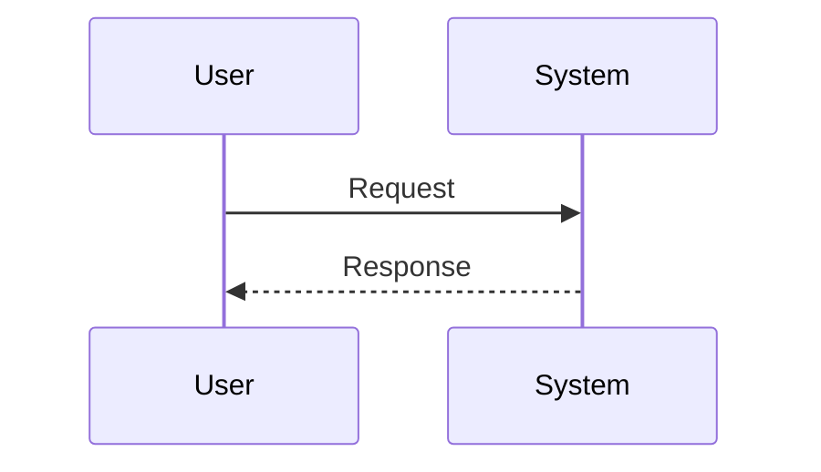

# Kiro Spec Mode Skill 设计与落地文档

文档日期：2026-05-01  
目标读者：想把 Kiro 的 Spec 模式复刻为可安装 Agent Skill 的开发者  
目标客户端：Claude Code、Codex、Kiro、以及其他支持 Agent Skills / `SKILL.md` 的 CLI 或 Agent 工具

> 当前项目实现更新：本仓库的实际 `spec-mode` skill 不再默认生成 `.kiro/specs/<slug>/`，也不再生成 `<需求名>/spec/` 子目录。当前生效规则以 [SKILL.md](/Users/xueqiang/Git/spec-mode/SKILL.md) 和 `scripts/spec_init.py` 为准：文档根目录下直接生成 `<具体需求名>/requirements.md`、`design.md`、`tasks.md`、`.config.json`。

## 0. 先说清楚：哪些是事实，哪些是实现建议

本文分为两层：

1. **事实层**：来自 Kiro 官方文档、Claude Code 官方文档、Agent Skills 标准文档的公开资料。
2. **实现层**：基于这些公开机制，为 CLI/Agent Skill 设计一个可落地的“类 Kiro Spec Mode”工作流。

不要把本文的实现建议理解为 Kiro IDE 内部实现。Kiro 的 IDE UI、`#spec` 上下文提供器、任务执行面板、属性测试生成细节等是产品能力，公开文档只描述了用户可见的行为。本文的原则是：**用文件、阶段门禁、可审查任务、测试闭环来复刻公开行为，不编造 Kiro 私有实现。**

## 1. 资料来源

优先使用官方资料。以下链接是本文的事实来源：

- Kiro Specs 总览：<https://kiro.dev/docs/specs/>
- Kiro Feature Specs：<https://kiro.dev/docs/specs/feature-specs/>
- Kiro Requirements-First Workflow：<https://kiro.dev/docs/specs/feature-specs/requirements-first/>
- Kiro Design-First Workflow：<https://kiro.dev/docs/specs/feature-specs/tech-design-first/>
- Kiro Bugfix Specs：<https://kiro.dev/docs/specs/bugfix-specs/>
- Kiro Spec Best Practices：<https://kiro.dev/docs/specs/best-practices/>
- Kiro Correctness with Property-based tests：<https://kiro.dev/docs/specs/correctness/>
- Kiro Steering：<https://kiro.dev/docs/steering/>
- Kiro CLI Steering：<https://kiro.dev/docs/cli/steering/>
- Kiro Agent Skills：<https://kiro.dev/docs/skills/>
- Claude Code Skills：<https://code.claude.com/docs/en/skills>
- Agent Skills 规范：<https://agentskills.io/specification>
- Agent Skills 总览：<https://agentskills.io/home>
- Agent Skills 创作最佳实践：<https://agentskills.io/skill-creation/best-practices>

## 2. Kiro Spec Mode 的公开工作原理

### 2.1 Spec 是什么

Kiro 官方把 Specs 定义为用于功能开发和缺陷修复的结构化工件。它们的目标是把高层想法转换为详细实现计划，并提供清晰的追踪与责任边界。

Kiro 官方说明 Specs 可以做到：

- 把需求拆成用户故事和验收标准。
- 生成包含序列图和架构计划的设计文档。
- 在离散任务之间追踪实现进度。
- 帮助产品和工程团队协作。

这说明 Kiro Spec Mode 的核心不是“先写文档再写代码”这么简单，而是一个**可追踪的需求到设计到任务到验证的状态机**。

### 2.2 核心文件结构

Kiro 官方明确说明每个 spec 会生成三个关键文件：

- `requirements.md` 或 `bugfix.md`
- `design.md`
- `tasks.md`

其中：

- `requirements.md` 用于功能需求，包含用户故事、验收标准和结构化需求。
- `bugfix.md` 用于缺陷修复，包含当前错误行为、期望行为、不应改变的行为。
- `design.md` 用于技术架构、序列图、实现考虑。
- `tasks.md` 用于离散、可追踪的实现任务。

Kiro 最佳实践页面也建议在仓库里维护多个 spec，而不是把整个项目塞进一个 spec。官方示例路径是：

```text
.kiro/specs/
├── user-authentication/
├── product-catalog/
├── shopping-cart/
├── payment-processing/
└── admin-dashboard/
```

Kiro 原生兼容布局如下：

```text
.kiro/specs/<spec-slug>/
├── requirements.md    # 功能 spec
├── bugfix.md          # bugfix spec，和 requirements.md 二选一
├── design.md
└── tasks.md
```

### 2.3 三阶段工作流

Kiro 官方总览描述了统一的三阶段流程：

1. **Requirements or Bug Analysis**：定义要构建什么或要修什么。
2. **Design**：在 `design.md` 中创建技术架构和实现方法。
3. **Tasks**：在 `tasks.md` 中生成离散、可执行的实现任务。

这三个阶段是 Spec Mode 的主轴。可安装 skill 应强制保持这个顺序，除非用户选择 Design-First。

### 2.4 Feature Spec 的两种变体

Kiro Feature Specs 支持两种工作流：

- **Requirements-First**：从系统行为和产品需求开始，然后生成设计和任务。
- **Design-First**：从技术设计、架构或伪代码开始，再推导可行需求和任务。

Kiro 官方给出的选择规则可以总结为：

- 当你知道系统要表现出什么行为、架构还可以调整时，选 Requirements-First。
- 当你已经有架构、低层设计、严格非功能要求，或要导入既有设计时，选 Design-First。

可安装 skill 应在启动时根据用户输入做 triage：

- 用户描述“我要做一个功能，用户可以……”：默认 Requirements-First。
- 用户描述“用某架构实现，必须满足延迟/吞吐/合规要求……”：默认 Design-First。
- 用户明确说“从设计开始”“技术方案先行”：Design-First。
- 不确定时问一个短问题，而不是擅自混合两种流程。

Kiro 最佳实践还明确说，创建 Feature Spec 后不能在同一个 spec 内切换工作流；如果需要换方法，创建新 spec 并复制相关内容。因此 skill 也应把工作流写入 spec 元数据或文档开头，并避免中途改流派。

### 2.5 EARS 需求写法

Kiro Feature Specs 使用 EARS，即 Easy Approach to Requirements Syntax。官方给出的核心形式是：

```text
WHEN [condition/event]
THE SYSTEM SHALL [expected behavior]
```

例如：

```text
WHEN a user submits a form with invalid data
THE SYSTEM SHALL display validation errors next to the relevant fields
```

Kiro 官方强调 EARS 带来的价值是清晰、可测试、可追踪、推动完整性。因此 portable skill 不能只写泛泛的需求段落，而要让每条验收标准都尽量落为：

- `WHEN ... THE SYSTEM SHALL ...`
- `IF ... THEN THE SYSTEM SHALL ...`
- `WHILE ... THE SYSTEM SHALL ...`
- `WHERE ... THE SYSTEM SHALL ...`
- 对 bugfix 的 unchanged behavior 使用 `SHALL CONTINUE TO`

本文建议用需求 ID 显式增强可追踪性，例如 `R-001`、`R-002`。

### 2.6 Requirements-First 的阶段细节

Kiro Requirements-First 官方页面描述：

1. 创建 Feature Spec，并选择 Requirements-First。
2. Kiro 根据提示生成 `requirements.md`。
3. 用户审查用户故事、验收标准、边界情况。
4. 用户确认后，Kiro 生成 `design.md`。
5. 用户审查技术方法、架构决策、技术选型。
6. Kiro 生成 `tasks.md`。
7. 执行任务，逐步实现功能。

因此，CLI skill 应该把 Requirements-First 实现为：

```text
输入想法
  -> 生成/更新 requirements.md
  -> 停下等待确认或明确的继续指令
  -> 生成/更新 design.md
  -> 停下等待确认或明确的继续指令
  -> 生成/更新 tasks.md
  -> 按任务实现和验证
```

如果用户明确要求“一次性生成完整 spec”，可以生成三个文件，但必须在文档中标记 `Review Status: unreviewed`，提醒尚未经过阶段确认。

### 2.7 Design-First 的阶段细节

Kiro Design-First 官方页面描述：

1. 创建 Feature Spec，并选择 Design-First。
2. 选择设计粒度：High Level Design 或 Low Level Design。
3. 生成 `design.md`。
4. 用户确认架构。
5. Kiro 从架构中推导可行需求。
6. 生成任务。
7. 执行实现。

官方把 High Level Design 描述为包含系统架构、组件描述、交互、技术方法、非功能属性；Low Level Design 更关注算法伪代码、接口契约、关键数据结构、非功能属性。

因此 portable skill 应支持：

- `design-level: high`：复杂系统、团队协作、完整文档。
- `design-level: low`：快速验证、独立开发、算法/接口/数据结构先行。

Design-First 的关键是：**需求必须从已确认设计中推导，且要保证技术可行性**。skill 不应在没有设计依据时随意扩展产品范围。

### 2.8 Bugfix Spec 的结构

Kiro Bugfix Specs 官方页面说明，Bugfix Spec 模仿资深开发者修 bug 的方式：找根因、理解要改变什么、明确不应该改变什么。

Bugfix Spec 与 Feature Spec 一样遵循三阶段流程，但第一阶段不是 `requirements.md`，而是 `bugfix.md`。

`bugfix.md` 应捕获：

```text
Current Behavior (Defect)
WHEN [condition] THEN the system [incorrect behavior]

Expected Behavior (Correct)
WHEN [condition] THEN the system SHALL [correct behavior]

Unchanged Behavior (Regression Prevention)
WHEN [condition] THEN the system SHALL CONTINUE TO [existing behavior]
```

这是 Kiro Bugfix Spec 最值得复刻的设计点：**bugfix 不只写“怎么修”，还写“不准破坏什么”。**

### 2.9 Bugfix 的设计和任务阶段

Kiro 官方说明 Bugfix 的 `design.md` 应包含：

- 根因分析。
- 修复方案。
- 要测试的 properties：
  - 当前实现能产生错误行为，用来验证 bug 确实存在。
  - 修复后产生正确行为，用来验证 fix。
  - 未改变行为继续成立，用来预防回归。

任务阶段会生成包含 property-based tests 的实现任务，用来验证：

- bug 可复现。
- bug 已修复。
- 没有引入回归。

CLI skill 未必能像 Kiro 一样自动生成和运行复杂 PBT，但必须把这个思想落地为任务顺序：

1. 先写复现测试或最小失败用例。
2. 再做最小修复。
3. 再补 unchanged behavior 的回归测试。
4. 最后运行相关测试并记录证据。

### 2.10 Correctness 与属性测试

Kiro Correctness 文档把 property 定义为关于系统应如何表现的通用陈述。它从 EARS 需求中提取可测试属性，并生成大量随机测试用例来验证实现是否符合规范。

官方也说明 PBT 不是形式化验证，不能保证没有所有 bug，但比只写示例测试提供更强的正确性证据。

portable skill 的可行实现：

- 在 `design.md` 中生成 `Property Candidates`。
- 在 `tasks.md` 中为每个可测试属性生成测试任务。
- 根据项目语言选择常见 PBT 库：
  - JavaScript/TypeScript：`fast-check`
  - Python：`hypothesis`
  - Rust：`proptest` 或 `quickcheck`
  - Java/Kotlin：`jqwik` 或 `QuickTheories`
  - Go：内置 fuzzing 或 `gopter`
- 如果项目没有 PBT 依赖，不强行引入；可以先生成参数化测试或表驱动测试。

### 2.11 Task Execution

Kiro 官方说明 `tasks.md` 有任务执行界面，能够显示实时状态，把任务更新为 in-progress 或 completed。

CLI skill 没有 IDE 面板，但可以用 Markdown 实现同样的状态持久化：

```markdown
- [ ] 1. Add validation schema
  - Status: pending
  - Requirements: R-003, R-004
  - Validation: npm test -- validation

- [ ] 2. Implement API handler
  - Status: in-progress
  - Requirements: R-001, R-002
  - Validation: npm test -- api

- [x] 3. Add regression tests
  - Status: completed
  - Requirements: R-005
  - Validation: npm test -- regression (passed 2026-05-01)
```

要求：

- 执行任务前，把目标任务改为 `Status: in-progress`。
- 完成并验证后，才勾选 `[x]` 和 `Status: completed`。
- 如果未能验证，保持未完成，并写明阻塞原因。
- 如果发现任务已经由别的会话完成，先扫描代码和测试，再更新状态。

### 2.12 Steering 的作用

Kiro Steering 不是 Spec 本身，但它是 Spec 质量的基础。

官方说明 Steering 通过 Markdown 文件给 Kiro 持久化项目知识。工作区 steering 位于：

```text
.kiro/steering/
```

全局 steering 位于：

```text
~/.kiro/steering/
```

Kiro 的基础 steering 文件包括：

- `product.md`：产品目的、目标用户、核心功能、业务目标。
- `tech.md`：框架、库、开发工具、技术约束。
- `structure.md`：文件组织、命名约定、导入模式、架构决策。

Kiro 官方还支持 inclusion modes：

- `always`：每次交互加载。
- `fileMatch`：按文件模式加载。
- `manual`：手动引用加载。
- `auto`：按描述自动匹配，类似 skill。

portable skill 应复用 Kiro 的 steering 思想：

- 每次创建或执行 spec 前，优先读取 `.kiro/steering/*.md`。
- 如果存在 `AGENTS.md`、`CLAUDE.md`、`.cursorrules`、项目 README，也可作为补充，但不能覆盖 `.kiro/steering`。
- 如果没有 steering，不阻塞 spec 创建；可以在 `design.md` 的 `Assumptions` 中记录“未发现 steering，已从代码结构推断”。
- 不应把敏感密钥写入 steering 或 spec。

### 2.13 Kiro Skill 与 Agent Skills 的关系

Kiro Agent Skills 官方文档说明，Kiro 支持 Agent Skills 开放标准。Skill 是一个包含 `SKILL.md` 的文件夹，可附带 `scripts/`、`references/`、`assets/`。

Kiro 的 skill 路径：

```text
.kiro/skills/<skill-name>/SKILL.md     # workspace skill
~/.kiro/skills/<skill-name>/SKILL.md   # global skill
```

Agent Skills 标准说明：

- skill 目录至少包含 `SKILL.md`。
- `SKILL.md` 必须有 YAML frontmatter 和 Markdown body。
- `name` 和 `description` 是核心字段。
- `scripts/` 用于可执行代码。
- `references/` 用于按需加载的详细文档。
- `assets/` 用于模板和静态资源。
- 推荐 progressive disclosure：启动时只加载名称和描述，触发后加载 `SKILL.md`，需要时再加载其他资源。

Claude Code 官方文档也说明 Claude Code skills 遵循 Agent Skills 开放标准，并扩展了直接 `/skill-name` 调用、`disable-model-invocation`、`allowed-tools`、`context: fork` 等能力。

因此，创建跨 CLI 的 Spec Mode Skill 时，应以 Agent Skills 标准为主，不绑定单一客户端。

## 3. Kiro Spec Mode 的设计思想

### 3.1 用文件把 AI 协作变成可审查流程

Kiro 的核心设计不是一次性 prompt，而是把 AI 的中间产物落到版本控制友好的 Markdown 文件中。这样带来几个好处：

- 需求、设计、任务都能被 diff、review、commit。
- 后续会话可以重新读取，而不是依赖聊天上下文记忆。
- 团队成员可以在 spec 层协作，而不是只看最终代码。
- AI 执行任务时有稳定合同，不容易漂移。

portable skill 应坚持“文件是状态源”，而不是把状态藏在对话中。

### 3.2 先约束行为，再生成实现

Requirements-First 通过 EARS 把用户期望变成可测试行为。Design-First 则先约束架构，再推导可行需求。二者共同点是：**代码生成之前，先把约束写下来。**

这避免了 vibe coding 常见的问题：

- 做着做着目标变了。
- AI 自行扩大范围。
- 设计没有追溯到需求。
- 测试只覆盖 happy path。

### 3.3 阶段门禁减少错误放大

Kiro 在 Requirements、Design、Tasks 之间要求用户 review 和确认。这个设计让错误更早被发现：

- 需求错了，不让它进入设计。
- 设计错了，不让它进入任务。
- 任务拆错了，不让它直接进入代码。

CLI skill 要保留这个门禁。只有在用户明确要求自动推进时，才跳过人工确认，并在文件中标注未审查。

### 3.4 Bugfix 的本质是最小变更与回归保护

Kiro Bugfix Spec 的三段式 bugfix.md 很关键：

- 当前错误行为。
- 期望正确行为。
- 保持不变的行为。

这个结构强迫 agent 在修 bug 前知道“不要碰坏什么”。这比“修一下这个 bug”更适合真实工程。

### 3.5 属性测试把自然语言需求接到验证

Kiro 的 PBT 思路是把 EARS 需求抽取成通用 properties，再用生成式测试寻找反例。portable skill 不必保证全自动 PBT，但应保留“每条需求尽量映射到测试或验证命令”的设计。

建议在 spec 中维护追踪矩阵：

```markdown
| Requirement | Design Section | Task | Test / Validation |
| --- | --- | --- | --- |
| R-001 | API Contract | T-003 | tests/auth/register.test.ts |
| R-002 | Error Handling | T-004 | tests/auth/register-errors.test.ts |
```

### 3.6 Steering 和 Spec 分层

Kiro 把长期项目知识放在 steering，把单个功能或 bug 的工作流放在 spec。这种分层非常适合 skill：

- `steering`：项目长期约束，慢变化。
- `spec`：某个功能/bug 的需求、设计、任务，随工作推进变化。
- `task execution`：当前执行状态，频繁变化。

不要把所有内容都塞进 `SKILL.md`。skill 只定义流程；项目知识和具体需求应留在仓库里。

## 4. 可落地的 Spec Mode Skill 方案

### 4.1 Skill 名称

建议名称：

```text
spec-mode
```

原因：

- 符合 Agent Skills 命名约束：小写、数字、连字符。
- 与 Kiro “Spec Mode”概念一致。
- 容易通过 `/spec-mode` 显式调用。

### 4.2 Skill 安装布局

通用 Agent Skills 结构：

```text
spec-mode/
├── SKILL.md
├── references/
│   ├── workflow.md
│   ├── templates.md
│   └── validation.md
├── assets/
│   └── templates/
│       ├── requirements.md
│       ├── bugfix.md
│       ├── design.md
│       └── tasks.md
└── scripts/
    └── spec_lint.py
```

不同客户端建议路径：

```text
# Kiro workspace
.kiro/skills/spec-mode/SKILL.md

# Kiro global
~/.kiro/skills/spec-mode/SKILL.md

# Claude Code project
.claude/skills/spec-mode/SKILL.md

# Claude Code personal
~/.claude/skills/spec-mode/SKILL.md

# Generic Agent Skills clients, such as VS Code Copilot Agent Skills examples
.agents/skills/spec-mode/SKILL.md

# Codex
# 建议使用当前 Codex 支持的 skill 安装机制；本地 Codex skill 结构同样以 SKILL.md 为入口，
# 可包含 scripts/、references/、assets/，必要时增加 agents/openai.yaml 作为 UI 元数据。
```

注意：**spec 输出路径**与 **skill 安装路径**不同。当前项目的输出路径是用户指定文档根目录下的 `<spec-slug>/`，例如 `specs/drag-image-into-editor/`。

### 4.3 Spec 输出目录

默认输出：

```text
<document-root>/<slug>/
```

slug 生成规则：

- 从功能名或 bug 名生成。
- 小写。
- 空格转连字符。
- 删除特殊字符。
- 尽量不超过 48 个字符。
- 如果重名，追加短后缀，例如 `checkout-tax-fix-2`。

示例：

```text
用户输入：实现用户登录和密码重置
slug：user-login-password-reset

用户输入：修复 O'Brien 姓名导致 500
slug：fix-apostrophe-name-500
```

### 4.4 Spec 元数据

Kiro 官方文档没有要求 spec 文件必须有 YAML frontmatter。为了最大化兼容，建议不要强制给所有文件加 frontmatter。可在 Markdown 顶部用普通段落记录元信息：

```markdown
# User Login Requirements

Spec Type: Feature
Workflow: Requirements-First
Created: 2026-05-01
Status: Requirements Draft
Review Status: unreviewed
```

这样不会破坏 Kiro Markdown 可读性，也方便普通工具解析。

### 4.5 Skill 触发条件

`description` 应覆盖以下触发词：

- spec
- specification
- spec mode
- Kiro
- requirements
- design doc
- tasks
- EARS
- bugfix spec
- property-based test
- 需求
- 设计
- 任务拆解
- 修复 bug 防回归

建议 description：

```yaml
description: Create and execute Kiro-style specs for features and bug fixes using requirements.md or bugfix.md, design.md, and tasks.md. Use when the user asks for spec mode, specification-driven development, requirements-first planning, design-first planning, EARS acceptance criteria, bugfix specs, task breakdown, or implementation from a tracked spec.
```

### 4.6 主工作流状态机

建议把 skill 实现成以下状态机：

```text
START
  -> Load Context
  -> Classify Intent
  -> Select Workflow
  -> Create or Locate Spec Folder
  -> Phase 1: Requirements / Bug Analysis / Design
  -> Review Gate
  -> Phase 2: Design / Requirements
  -> Review Gate
  -> Phase 3: Tasks
  -> Review Gate
  -> Execute Selected Task(s)
  -> Verify
  -> Update tasks.md
  -> Summarize
```

状态定义：

```text
drafting-requirements
requirements-review
drafting-design
design-review
drafting-tasks
tasks-review
implementing
verifying
completed
blocked
```

状态可以写在相关文件顶部，也可以只在 `tasks.md` 中维护。

### 4.7 启动时必须读取的上下文

当 skill 被调用时，agent 应按顺序读取：

1. 当前用户请求。
2. 现有 spec 文件，如果用户提到了 spec 名或当前目录已有 `.kiro/specs/`。
3. `.kiro/steering/product.md`
4. `.kiro/steering/tech.md`
5. `.kiro/steering/structure.md`
6. `.kiro/steering/*.md` 其他相关文件。
7. `AGENTS.md`
8. 客户端特定项目指令，例如 `CLAUDE.md`、Codex 当前系统/开发者指令。
9. `README.md`、package/build/test 配置、关键源码结构。

读取策略：

- 先用 `rg --files` 找文件。
- 不要读取大型生成目录，例如 `node_modules`、`dist`、`build`。
- 如果 steering 与代码不一致，以当前代码和测试为准，并在 `design.md` 写明发现的不一致。

### 4.8 阶段门禁规则

Kiro 的公开工作流强调 review 与迭代。Skill 应遵循：

- 生成 `requirements.md` 后，除非用户明确要求继续，否则停止并请用户 review。
- 生成 `design.md` 后，除非用户明确要求继续，否则停止并请用户 review。
- 生成 `tasks.md` 后，除非用户明确要求实现，否则停止并请用户确认任务。
- 如果用户说“直接完整生成 spec，但不要实现”，可以连续生成三个文档，但不写代码。
- 如果用户说“按 spec 实现 task 2”，必须先加载对应 spec 全部文件。
- 如果用户说“自动跑完整流程”，可以推进到实现，但仍要在每个文件中标注假设和未审查状态。

### 4.9 Requirements-First 文件生成规则

`requirements.md` 必须包含：

- 标题。
- Spec Type。
- Workflow。
- Overview。
- Goals。
- Non-Goals。
- User Stories。
- EARS Acceptance Criteria。
- Edge Cases。
- Non-Functional Requirements。
- Assumptions。
- Requirements Traceability。

要求：

- 每条验收标准必须有 ID。
- 每条验收标准尽量用 EARS。
- 不把实现细节塞进需求，除非用户明确给出技术约束。
- 边界情况和错误处理必须写入 EARS。
- 不确定项写在 Open Questions，不要编造成事实。

### 4.10 Design-First 文件生成规则

Design-First 的 `design.md` 必须先于 `requirements.md`。

`design.md` 必须包含：

- Design Level：High 或 Low。
- Context。
- Constraints。
- Architecture。
- Components。
- Interfaces / API Contracts。
- Data Model。
- Sequence / Flow。
- Error Handling。
- Security / Privacy。
- Performance / Reliability。
- Testing Strategy。
- Property Candidates。
- Risks。
- Open Questions。

然后从设计推导 `requirements.md`：

- 需求不得超出设计允许的能力。
- 对用户可见行为使用 EARS。
- 对非功能要求写成可验证目标，例如延迟、吞吐、兼容性、安全约束。

### 4.11 Bugfix 文件生成规则

`bugfix.md` 必须包含：

- Bug Summary。
- Reproduction Steps。
- Current Behavior。
- Expected Behavior。
- Unchanged Behavior。
- Impact。
- Constraints。
- Evidence。
- Open Questions。

格式示例：

```markdown
## Current Behavior

B-001:
WHEN a user submits a name containing an apostrophe
THEN the API returns HTTP 500.

## Expected Behavior

B-002:
WHEN a user submits a valid name containing an apostrophe
THE SYSTEM SHALL save the name and return HTTP 201.

## Unchanged Behavior

B-003:
WHEN a user submits an invalid email address
THE SYSTEM SHALL CONTINUE TO return a validation error without creating an account.
```

Bugfix 的 `design.md` 必须包含根因分析。不能在没读代码、没复现或没证据的情况下声称根因已经确定。若尚未复现，应写：

```text
Root Cause Status: suspected, not confirmed
```

### 4.12 `tasks.md` 生成规则

任务必须：

- 离散。
- 可执行。
- 有清晰结果。
- 映射到需求或 bug behavior。
- 包含验证方法。
- 标明 required 或 optional。
- 避免“一次实现整个系统”这种大任务。

建议格式：

```markdown
# Tasks

Spec Type: Feature
Workflow: Requirements-First
Status: ready-for-implementation

## Task List

- [ ] T-001. Add request validation schema
  - Status: pending
  - Type: implementation
  - Requirements: R-001, R-004
  - Depends on: none
  - Validation: npm test -- validation

- [ ] T-002. Add API contract tests
  - Status: pending
  - Type: test
  - Requirements: R-001, R-002, R-003
  - Depends on: T-001
  - Validation: npm test -- api
```

Bugfix task 顺序建议：

```markdown
- [ ] T-001. Add failing reproduction test
  - Status: pending
  - Type: test
  - Behavior: B-001
  - Validation: test fails before fix

- [ ] T-002. Implement minimal fix
  - Status: pending
  - Type: implementation
  - Behavior: B-002
  - Depends on: T-001
  - Validation: reproduction test passes

- [ ] T-003. Add unchanged behavior regression test
  - Status: pending
  - Type: test
  - Behavior: B-003
  - Depends on: T-002
  - Validation: regression test passes
```

### 4.13 任务执行规则

执行任务时：

1. 加载完整 spec 文件。
2. 找到目标任务和相关需求 ID。
3. 检查工作区状态，避免覆盖用户改动。
4. 把任务状态改为 `in-progress`。
5. 实现最小必要变更。
6. 运行任务指定验证命令。
7. 更新 `tasks.md`：
   - 通过验证：`[x]`、`Status: completed`、记录验证命令。
   - 验证失败：保持未完成，记录失败原因。
   - 阻塞：`Status: blocked`，写明缺少信息或依赖。
8. 总结实际改动、验证结果和剩余任务。

绝对不要：

- 没有读 `requirements.md` / `bugfix.md` 就直接实现。
- 没有验证就勾选完成。
- 发现需求与代码冲突时默默改需求。
- 为了完成任务而删除或弱化验收标准。

### 4.14 Spec 更新规则

Kiro 最佳实践说明 specs 需要持续迭代。portable skill 应支持：

- `update requirements`：更新 `requirements.md`，然后提示需要同步 `design.md` 和 `tasks.md`。
- `update design`：更新 `design.md`，然后验证 requirements 是否仍可行。
- `update tasks`：根据 requirements/design 重新生成或调整任务。
- `check completed tasks`：扫描代码和测试，把已经完成的任务标记完成。

推荐规则：

```text
需求变化 -> 必须检查 design 和 tasks
设计变化 -> 必须检查 requirements 是否仍匹配，再更新 tasks
任务变化 -> 不应改变 requirements，除非发现需求错误并明确标记
实现发现偏差 -> 先回到 spec 更新，而不是直接扩大实现范围
```

### 4.15 引用现有 spec

Kiro 支持用 `#spec` 在聊天中引用 spec，并自动包含所有 spec 文件。CLI skill 可以用显式语法模拟：

```text
/spec-mode #spec:user-authentication implement T-003
/spec-mode use spec user-authentication and update tasks
/spec-mode validate .kiro/specs/user-authentication
```

skill 应解析：

- `#spec:<slug>`
- `.kiro/specs/<slug>`
- 当前打开/最近修改的 spec 目录

并加载其中所有相关文件。

## 5. 推荐 Skill 包内容

### 5.1 `SKILL.md` 推荐版本

下面是一份可直接作为起点的 `SKILL.md`。为了跨客户端兼容，frontmatter 使用 Agent Skills 标准字段为主；Claude Code 专有字段只作为注释建议，不默认启用。

```markdown
---
name: spec-mode
description: Create and execute Kiro-style specs for features and bug fixes using requirements.md or bugfix.md, design.md, and tasks.md. Use when the user asks for spec mode, specification-driven development, requirements-first planning, design-first planning, EARS acceptance criteria, bugfix specs, task breakdown, or implementation from a tracked spec.
compatibility: Requires an agent that can read and write workspace files. Best with tools that can search files and run project tests.
---

# Spec Mode

Use this skill to run a Kiro-style specification workflow. The source of truth is a version-controlled spec folder under the user's document root, for example `specs/<spec-slug>/`.

## Core Rules

1. Do not jump straight to implementation unless the user explicitly asks to implement.
2. Keep spec artifacts on disk:
   - Feature: `requirements.md`, `design.md`, `tasks.md`
   - Bugfix: `bugfix.md`, `design.md`, `tasks.md`
3. Use `<document-root>/<spec-slug>/` by default. Do not add an extra `spec/` child folder.
4. Read `.kiro/steering/*.md` and relevant project instructions before generating or executing a spec.
5. Preserve phase gates:
   - Requirements or bug analysis before design
   - Design before tasks
   - Tasks before implementation
6. Mark assumptions and open questions instead of inventing facts.
7. Never mark a task complete until its validation has run or the user explicitly accepts skipped validation.

## Workflow Selection

Classify the request:

- Feature + behavior-first input -> Requirements-First
- Feature + architecture/design/strict technical constraints -> Design-First
- Bug report, regression, failing test, production defect -> Bugfix Spec

If ambiguous and the choice changes the workflow, ask one concise clarification question.

## Context Loading

Before writing or executing a spec:

1. Locate the workspace root.
2. Read existing spec files if a spec is referenced.
3. Read `.kiro/steering/product.md`, `tech.md`, `structure.md` when present.
4. Read other relevant `.kiro/steering/*.md` files.
5. Read `AGENTS.md`, `CLAUDE.md`, README, build/test configuration, and relevant source files as needed.

## Feature: Requirements-First

1. Create `.kiro/specs/<slug>/requirements.md`.
2. Write user stories and EARS acceptance criteria:
   - `WHEN [condition/event]`
   - `THE SYSTEM SHALL [expected behavior]`
3. Include goals, non-goals, edge cases, non-functional requirements, assumptions, and open questions.
4. Stop for review unless the user asked for full spec generation.
5. After approval, create `design.md`.
6. Stop for review.
7. After approval, create `tasks.md`.

## Feature: Design-First

1. Create `.kiro/specs/<slug>/design.md` first.
2. Choose high-level or low-level design from the user input:
   - High-level: architecture, components, interactions, non-functional properties.
   - Low-level: algorithms, interfaces, data structures, contracts.
3. Stop for review unless the user asked for full spec generation.
4. Derive feasible EARS requirements into `requirements.md`.
5. Create `tasks.md` only after design and requirements are aligned.

## Bugfix Spec

1. Create `.kiro/specs/<slug>/bugfix.md`.
2. Capture:
   - Current Behavior: `WHEN [condition] THEN the system [incorrect behavior]`
   - Expected Behavior: `WHEN [condition] THEN the system SHALL [correct behavior]`
   - Unchanged Behavior: `WHEN [condition] THEN the system SHALL CONTINUE TO [existing behavior]`
3. Investigate the codebase before claiming root cause.
4. Write `design.md` with root cause analysis, proposed fix, and properties/tests.
5. Write `tasks.md` with reproduction test first, minimal fix second, regression protection third.

## Task Execution

When implementing from a spec:

1. Load all files in the spec folder.
2. Identify the task ID and linked requirement or behavior IDs.
3. Update the task status to `in-progress`.
4. Make the smallest code change that satisfies the task.
5. Run the validation command listed in `tasks.md`, or the nearest relevant project test.
6. Mark the task completed only when validation passes.
7. If validation cannot run, record why and keep the task incomplete unless the user explicitly accepts it.

## Output

Keep user-facing summaries short:

- Spec path
- Files created or updated
- Current phase
- Review needed or next task
- Validation run and result

For detailed templates, read `references/templates.md` when needed.
For linting rules, read `references/validation.md` when needed.
```

### 5.2 `references/templates.md`

建议把长模板放到 `references/templates.md`，避免 `SKILL.md` 太大。

#### 文件标题

```markdown
# Spec Templates
```

#### `requirements.md`

```markdown
# [Feature Name] Requirements

Spec Type: Feature
Workflow: Requirements-First
Status: Requirements Draft
Review Status: unreviewed

## Overview

[What this feature does and why it matters.]

## Goals

- [Goal 1]
- [Goal 2]

## Non-Goals

- [Explicitly out of scope]

## User Stories

### US-001: [Story Name]

As a [user type], I want [capability], so that [benefit].

#### Acceptance Criteria

R-001:
WHEN [condition/event]
THE SYSTEM SHALL [expected behavior].

R-002:
WHEN [condition/event]
THE SYSTEM SHALL [expected behavior].

## Edge Cases

R-EDGE-001:
WHEN [edge condition]
THE SYSTEM SHALL [safe behavior].

## Non-Functional Requirements

NFR-001:
WHEN [operational condition]
THE SYSTEM SHALL [measurable quality].

## Assumptions

- [Assumption]

## Open Questions

- [Question]

## Traceability

| Requirement | Source | Notes |
| --- | --- | --- |
| R-001 | User prompt | |
```

#### `bugfix.md`

```markdown
# [Bug Name] Bugfix

Spec Type: Bugfix
Status: Bug Analysis Draft
Review Status: unreviewed

## Bug Summary

[Short description of the defect.]

## Reproduction Steps

1. [Step]
2. [Step]
3. [Observed result]

## Current Behavior

B-001:
WHEN [condition]
THEN the system [incorrect behavior].

## Expected Behavior

B-002:
WHEN [condition]
THE SYSTEM SHALL [correct behavior].

## Unchanged Behavior

B-003:
WHEN [related condition]
THE SYSTEM SHALL CONTINUE TO [existing behavior].

## Impact

- [User/business/technical impact]

## Constraints

- [Code or behavior that must not change]

## Evidence

- [Logs, tests, screenshots, user reports, error messages]

## Open Questions

- [Question]
```

#### `design.md`

````markdown
# [Spec Name] Design

Spec Type: [Feature | Bugfix]
Workflow: [Requirements-First | Design-First | Bugfix]
Status: Design Draft
Review Status: unreviewed

## Overview

[Implementation overview.]

## Steering Context

- Product: [summary from .kiro/steering/product.md if available]
- Tech: [summary from .kiro/steering/tech.md if available]
- Structure: [summary from .kiro/steering/structure.md if available]

## Requirements Mapping

| Requirement / Behavior | Design Section |
| --- | --- |
| R-001 | [Section] |

## Architecture

[Architecture description. Use Mermaid if useful.]

## Components

| Component | Responsibility | Notes |
| --- | --- | --- |
| [Name] | [Responsibility] | |

## Data Model

[Schemas, entities, migrations, storage changes.]

## Interfaces

[APIs, functions, events, CLI commands, contracts.]

## Flow



## Error Handling

[Expected failures and handling.]

## Security and Privacy

[Auth, authorization, data validation, secrets, PII.]

## Performance and Reliability

[Latency, throughput, retry, idempotency, concurrency.]

## Testing Strategy

- Unit:
- Integration:
- End-to-end:
- Regression:

## Property Candidates

P-001:
For any [input class] where [precondition], when [event], the system shall [invariant].
Linked requirements: R-001

## Risks

- [Risk and mitigation]

## Open Questions

- [Question]
````

#### `tasks.md`

```markdown
# [Spec Name] Tasks

Spec Type: [Feature | Bugfix]
Workflow: [Requirements-First | Design-First | Bugfix]
Status: ready-for-implementation

## Task List

- [ ] T-001. [Task title]
  - Status: pending
  - Type: [implementation | test | docs | refactor]
  - Requirements: [R-001]
  - Depends on: none
  - Validation: [command]

- [ ] T-002. [Task title]
  - Status: pending
  - Type: [implementation | test | docs | refactor]
  - Requirements: [R-002]
  - Depends on: T-001
  - Validation: [command]

## Traceability

| Task | Requirement / Behavior | Validation |
| --- | --- | --- |
| T-001 | R-001 | [command] |
```

### 5.3 `references/validation.md`

```markdown
# Spec Validation Rules

## Required Files

Feature specs must contain:

- `requirements.md`
- `design.md`
- `tasks.md`

Bugfix specs must contain:

- `bugfix.md`
- `design.md`
- `tasks.md`

## Requirements Validation

- Every acceptance criterion has an ID.
- Most acceptance criteria use EARS.
- Requirements avoid implementation details unless they are user-provided constraints.
- Open questions are explicit.

## Design Validation

- Design maps to every requirement or bug behavior.
- Design includes testing strategy.
- Bugfix design includes root cause status.
- Design does not expand scope without adding requirements.

## Task Validation

- Every task has an ID.
- Every implementation task maps to at least one requirement or behavior.
- Every task has a validation command or explicit validation note.
- Completed tasks include evidence of validation.

## Execution Validation

Before marking complete:

1. Run listed validation.
2. Record command and result.
3. If skipped, record who accepted the skip and why.
```

### 5.4 可选 `scripts/spec_lint.py`

这个脚本不是 Kiro 官方能力，只是一个落地辅助。它可以检查 spec 文件是否完整、EARS 是否缺失、任务是否未映射需求。

```python
#!/usr/bin/env python3
from __future__ import annotations

import argparse
import re
from pathlib import Path


REQ_ID = re.compile(r"\bR-[A-Z0-9-]*\d+\b")
BUG_ID = re.compile(r"\bB-[A-Z0-9-]*\d+\b")
TASK_ID = re.compile(r"\bT-[A-Z0-9-]*\d+\b")
EARS = re.compile(r"\b(WHEN|IF|WHILE|WHERE)\b.+\bTHE SYSTEM SHALL\b", re.I | re.S)


def read(path: Path) -> str:
    return path.read_text(encoding="utf-8")


def fail(errors: list[str], message: str) -> None:
    errors.append(message)


def lint_spec(spec_dir: Path) -> list[str]:
    errors: list[str] = []
    req = spec_dir / "requirements.md"
    bug = spec_dir / "bugfix.md"
    design = spec_dir / "design.md"
    tasks = spec_dir / "tasks.md"

    if not design.exists():
        fail(errors, "Missing design.md")
    if not tasks.exists():
        fail(errors, "Missing tasks.md")
    if req.exists() and bug.exists():
        fail(errors, "Spec should not contain both requirements.md and bugfix.md")
    if not req.exists() and not bug.exists():
        fail(errors, "Missing requirements.md or bugfix.md")

    ids: set[str] = set()
    if req.exists():
        text = read(req)
        ids.update(REQ_ID.findall(text))
        if "THE SYSTEM SHALL" not in text:
            fail(errors, "requirements.md has no EARS-style THE SYSTEM SHALL criteria")
    if bug.exists():
        text = read(bug)
        ids.update(BUG_ID.findall(text))
        if "SHALL CONTINUE TO" not in text:
            fail(errors, "bugfix.md should include unchanged behavior with SHALL CONTINUE TO")

    if tasks.exists():
        text = read(tasks)
        task_ids = TASK_ID.findall(text)
        if not task_ids:
            fail(errors, "tasks.md has no task IDs")
        for task in task_ids:
            pattern = re.compile(rf"{re.escape(task)}[\s\S]*?(?=\n- \[|\Z)")
            match = pattern.search(text)
            block = match.group(0) if match else ""
            if "Validation:" not in block:
                fail(errors, f"{task} is missing Validation")
            if ids and not any(i in block for i in ids):
                fail(errors, f"{task} does not reference any requirement/behavior ID")

    return errors


def main() -> int:
    parser = argparse.ArgumentParser()
    parser.add_argument("spec_dir", type=Path)
    args = parser.parse_args()
    errors = lint_spec(args.spec_dir)
    if errors:
        for error in errors:
            print(f"ERROR: {error}")
        return 1
    print("Spec lint passed")
    return 0


if __name__ == "__main__":
    raise SystemExit(main())
```

注意：这个脚本只做轻量检查，不替代人工 review，也不等价于 Kiro PBT。

## 6. 客户端适配建议

### 6.1 Claude Code

Claude Code 官方说明：

- Skill 可以放在 `~/.claude/skills/<skill-name>/SKILL.md` 或 `.claude/skills/<skill-name>/SKILL.md`。
- skill 可以被 Claude 自动调用，也可以用 `/skill-name` 显式调用。
- Claude Code skills 遵循 Agent Skills 开放标准，并有额外 frontmatter。

建议 Claude Code 版本：

```yaml
---
name: spec-mode
description: Create and execute Kiro-style specs for features and bug fixes using requirements.md or bugfix.md, design.md, and tasks.md. Use for spec mode, requirements-first, design-first, EARS acceptance criteria, bugfix specs, and tracked task implementation.
argument-hint: "[create|update|implement|validate] [spec-name or task-id]"
allowed-tools: Read Grep Glob Bash
---
```

如果你担心它在普通开发请求中过度触发，可以加：

```yaml
disable-model-invocation: true
```

这样只能用 `/spec-mode` 手动触发。缺点是用户不显式调用时不会自动进入 Spec Mode。

### 6.2 Codex

Codex 的 skill 结构同样以 `SKILL.md` 为核心，并支持 `scripts/`、`references/`、`assets/` 等渐进式披露结构。本机 Codex skill-creator 指南还建议在需要 UI 元数据时添加：

```text
agents/openai.yaml
```

建议 Codex 版本保持标准 Agent Skills frontmatter，不依赖 Claude Code 专有字段：

```yaml
---
name: spec-mode
description: Create and execute Kiro-style specs for features and bug fixes using requirements.md or bugfix.md, design.md, and tasks.md. Use when the user asks for spec mode, specification-driven development, requirements-first planning, design-first planning, EARS acceptance criteria, bugfix specs, task breakdown, or implementation from a tracked spec.
---
```

Codex 中尤其要强调：

- 搜索文件优先用 `rg`。
- 编辑 spec 和代码要保护用户已有改动。
- 执行任务前先说明将修改哪些文件。
- 任务完成必须运行验证，无法运行要说明。

### 6.3 Kiro

Kiro 自身已经有官方 Specs 功能。这个 skill 在 Kiro 中的意义更像：

- 统一团队自定义规范。
- 增加额外 lint、模板、公司流程。
- 为 Kiro CLI 或 custom agents 提供 Spec-like 工作流。

Kiro skill 可放：

```text
.kiro/skills/spec-mode/
~/.kiro/skills/spec-mode/
```

注意 Kiro CLI Steering 文档说明，自定义 agents 不会自动包含 steering files，必须在 agent 配置中显式加 resources：

```json
{
  "resources": ["file://.kiro/steering/**/*.md"]
}
```

如果你的 spec-mode skill 会被 Kiro custom agent 使用，应把 `.kiro/steering/**/*.md` 加入资源配置，或在 skill 说明中要求 agent 主动读取。

### 6.4 Generic Agent Skills 客户端

Agent Skills 标准只规定 skill 目录结构，不规定每个客户端的安装目录。通用规则：

- `SKILL.md` 必须存在。
- `name` 应匹配目录名。
- `description` 要同时说明“做什么”和“何时使用”。
- 大模板放 `references/` 或 `assets/`。
- 可重复、易错、机械检查放 `scripts/`。

## 7. 实际使用流程示例

### 7.1 创建 Requirements-First Feature Spec

用户：

```text
/spec-mode 为后台管理系统增加用户邀请功能，管理员可以邀请新成员，邀请邮件 24 小时有效。
```

agent 行为：

1. 读取 steering 和项目结构。
2. 识别为 Feature + Requirements-First。
3. 创建 `.kiro/specs/user-invitations/requirements.md`。
4. 写入用户故事和 EARS 验收标准。
5. 停下让用户 review。

输出摘要：

```text
已创建 `.kiro/specs/user-invitations/requirements.md`。
当前阶段：Requirements Review。
请确认需求和验收标准；确认后我会生成 design.md。
```

### 7.2 继续生成设计

用户：

```text
需求没问题，继续 design
```

agent 行为：

1. 读取 requirements。
2. 读取相关代码。
3. 生成 design，包括 API、数据模型、邮件发送、过期处理、测试策略。
4. 停下 review。

### 7.3 生成任务

用户：

```text
设计确认，生成 tasks
```

agent 行为：

1. 读取 requirements 和 design。
2. 生成任务。
3. 每个任务映射 R-ID。
4. 每个任务包含验证命令。

### 7.4 实现单个任务

用户：

```text
/spec-mode #spec:user-invitations implement T-003
```

agent 行为：

1. 加载 `.kiro/specs/user-invitations/*`。
2. 找到 T-003 和相关需求。
3. 标记 T-003 in-progress。
4. 编辑代码。
5. 运行验证。
6. 更新任务状态。

### 7.5 创建 Bugfix Spec

用户：

```text
/spec-mode 修复注册接口中姓名包含 O'Brien 会返回 500 的问题，邮箱和密码校验行为不能变。
```

agent 行为：

1. 识别为 Bugfix Spec。
2. 创建 `.kiro/specs/fix-apostrophe-name-500/bugfix.md`。
3. 写 Current / Expected / Unchanged Behavior。
4. 检查注册接口代码和测试。
5. 生成 design，根因状态如果未验证就写 suspected。
6. 生成任务：复现测试、最小修复、回归测试。

## 8. Prompt 和行为守则

### 8.1 创建 spec 时的系统行为

agent 应遵循：

```text
You are operating in Spec Mode. Treat files under `.kiro/specs/<slug>/` as the source of truth. Do not implement before the spec reaches tasks unless the user explicitly requests implementation. Use EARS for acceptance criteria. Preserve review gates. Record assumptions and open questions instead of inventing missing facts.
```

### 8.2 实现任务时的系统行为

```text
Before implementing, load requirements.md or bugfix.md, design.md, and tasks.md. Identify the selected task, linked requirements, and validation command. Update task status to in-progress before editing. Make the smallest code change needed. Run validation. Mark completed only if validation passes.
```

### 8.3 Bugfix 时的系统行为

```text
For bugfix specs, first preserve the distinction between current behavior, expected behavior, and unchanged behavior. Do not claim root cause without code or test evidence. Prefer adding a failing reproduction test before implementing the fix. Add regression coverage for unchanged behavior.
```

### 8.4 遇到不确定时

```text
If a detail is unknown, add it to Open Questions or Assumptions. Ask the user only when the answer materially affects workflow, scope, architecture, or data safety.
```

## 9. 验证与质量标准

### 9.1 文档质量

一个合格 Feature Spec：

- 有清晰目标和非目标。
- 用户故事不混入实现细节。
- 验收标准大多为 EARS。
- 每条需求有 ID。
- 设计覆盖所有需求。
- 任务覆盖所有需求。
- 任务包含验证方式。

一个合格 Bugfix Spec：

- 能复述 bug 的触发条件。
- 区分当前错误行为和期望行为。
- 明确不应改变的行为。
- 设计包含根因状态。
- 任务先复现，再修复，再防回归。
- 至少有一个验证 bug 修复的测试或命令。

### 9.2 实现质量

任务完成标准：

- 代码实现只覆盖任务范围。
- 所有相关测试通过。
- `tasks.md` 有验证记录。
- 若发现 spec 过时，已更新 spec 或记录偏差。
- 没有无关重构。

### 9.3 追踪矩阵

每个 spec 推荐维护：

```markdown
| Requirement / Behavior | Design | Task | Validation |
| --- | --- | --- | --- |
| R-001 | API Contract | T-002 | npm test -- api |
| R-002 | Error Handling | T-003 | npm test -- errors |
| B-003 | Regression Protection | T-004 | npm test -- registration |
```

这能让 agent 在实现时不丢需求。

## 10. 安全与边界

### 10.1 不要伪装成 Kiro 内部实现

skill 文档中应避免这些说法：

- “完全实现 Kiro 内部 Spec 引擎。”
- “自动复刻 Kiro 的 PBT 生成器。”
- “与 Kiro IDE UI 状态完全一致。”

推荐说法：

- “实现基于 Kiro 公开文档的 Spec 工作流。”
- “使用 Kiro 兼容的 `.kiro/specs/` 文件布局。”
- “用 Markdown 状态模拟任务执行状态。”
- “可选生成 property-based test 候选，不保证等价于 Kiro 内置 PBT。”

### 10.2 不要把敏感信息写进 spec

禁止写入：

- API key。
- 密码。
- 私钥。
- 生产数据库连接串。
- 用户隐私数据样本。

如果需求涉及敏感数据，用占位符和数据分类说明。

### 10.3 控制自动实现

Spec Mode 的价值在于降低漂移。自动实现很方便，但需要边界：

- 默认只生成当前阶段文件。
- 用户明确说“实现”才写代码。
- 用户明确说“run all tasks”才连续执行多个任务。
- 连续任务之间如果测试失败，应停止。

### 10.4 第三方 Skill 风险

Agent Skills 可以携带脚本。安装来自第三方的 skill 时，应审查：

- `SKILL.md` 是否包含危险指令。
- `scripts/` 是否会删除、上传、加密或外传文件。
- 是否使用 shell 动态注入。
- 是否要求过宽权限。

对于 spec-mode，脚本应限制为 lint、模板生成、格式检查，不应执行部署、删除、上传等副作用动作。

## 11. 推荐落地路线

### 11.1 第 1 版：纯 Markdown Skill

目标：先跑通流程。

内容：

```text
spec-mode/
└── SKILL.md
```

能力：

- 创建 `.kiro/specs/<slug>/`。
- 生成 requirements/bugfix、design、tasks。
- 实现单个 task。
- 更新 tasks 状态。

### 11.2 第 2 版：模板和验证

目标：提高一致性。

增加：

```text
references/templates.md
references/validation.md
assets/templates/*.md
scripts/spec_lint.py
```

能力：

- 模板化输出。
- lint spec 完整性。
- 检查任务是否映射需求。

### 11.3 第 3 版：项目集成

目标：更像真实工程系统。

增加：

- 自动读取 `.kiro/steering`。
- 从 package/test 配置推断验证命令。
- 生成 traceability matrix。
- 根据语言建议 PBT 库。
- 支持 `check completed tasks`。

### 11.4 第 4 版：团队治理

目标：团队共用。

增加：

- 公司级 `steering` 模板。
- spec review checklist。
- PR 模板中引用 spec。
- CI 中运行 `spec_lint.py`。
- 要求所有大功能 PR 链接 `.kiro/specs/<slug>`。

## 12. 最小可用 Skill 包

如果你现在就要创建一个最小可用版本，推荐：

```text
spec-mode/
├── SKILL.md
└── references/
    └── templates.md
```

`SKILL.md` 用第 5.1 节内容。`templates.md` 用第 5.2 节内容。先不要加脚本，等团队实际用过几次后，再把重复检查沉淀成 `spec_lint.py`。

## 13. 成功标准

这个 spec-mode skill 做成后，应该能在 Claude Code/Codex 中完成以下任务：

1. 用户给一句功能想法，agent 创建 Kiro 兼容 spec 目录和 `requirements.md`。
2. 用户确认后，agent 生成技术 `design.md`。
3. 用户确认后，agent 生成 `tasks.md`。
4. 用户指定任务 ID，agent 按 spec 实现，不扩大范围。
5. agent 运行验证并更新任务状态。
6. 用户给 bug，agent 创建 `bugfix.md`，明确 current/expected/unchanged behavior。
7. bugfix 任务先补复现测试，再修复，再补回归保护。
8. 所有 spec 文件都能被版本控制、review、复用。

如果能做到这些，就已经真实落地了 Kiro 公开 Spec Mode 的核心价值：**结构化需求、技术设计、任务追踪、验证闭环和工程可审查性**。

## 14. 资料映射表

| 本文主题 | 来源 |
| --- | --- |
| Specs 是结构化工件，三文件结构，三阶段流程 | Kiro Specs 总览：<https://kiro.dev/docs/specs/> |
| Feature Specs、Requirements-First、Design-First、EARS | Kiro Feature Specs：<https://kiro.dev/docs/specs/feature-specs/> |
| Requirements-First 阶段细节 | <https://kiro.dev/docs/specs/feature-specs/requirements-first/> |
| Design-First 阶段细节 | <https://kiro.dev/docs/specs/feature-specs/tech-design-first/> |
| Bugfix 的 current/expected/unchanged 结构 | Kiro Bugfix Specs：<https://kiro.dev/docs/specs/bugfix-specs/> |
| PBT 与 spec correctness | <https://kiro.dev/docs/specs/correctness/> |
| 多 spec、`.kiro/specs/`、`#spec`、更新任务 | <https://kiro.dev/docs/specs/best-practices/> |
| `.kiro/steering`、foundation steering、inclusion modes | <https://kiro.dev/docs/steering/> |
| Kiro CLI steering 与 custom agent resources | <https://kiro.dev/docs/cli/steering/> |
| Kiro Agent Skills 支持开放 Agent Skills 标准 | <https://kiro.dev/docs/skills/> |
| Claude Code skill 安装位置和扩展字段 | <https://code.claude.com/docs/en/skills> |
| Agent Skills 目录结构、frontmatter、progressive disclosure | <https://agentskills.io/specification> |
| Skill 创作最佳实践 | <https://agentskills.io/skill-creation/best-practices> |
