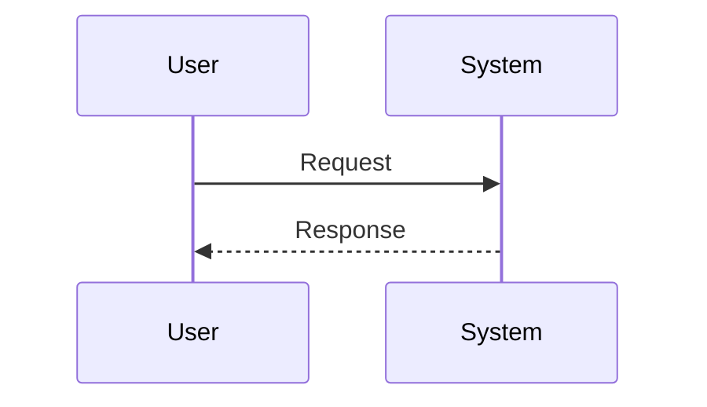

# Spec Templates

Use these templates when generating documents. Prefer adapting wording to the project and language of the user request.

## `requirements.md`

```markdown
# 需求文档

Spec Type: Feature
Workflow: requirements-first
Status: Requirements Draft
Review Status: unreviewed

## 简介

[说明要实现的能力、用户价值、当前背景。若已有代码上下文，简述相关模块和约束。]

---

## 词汇表

- **[Term]**：[定义]

---

## 需求

### 需求 1：[需求标题]

**用户故事：** 作为[用户/角色]，我希望[能力]，以便[价值]。

#### 验收标准

1. WHEN [触发条件]，THE [系统/组件] SHALL [期望行为]。
2. IF [条件]，THEN THE [系统/组件] SHALL [期望行为]。
3. WHILE [状态]，THE [系统/组件] SHALL [持续行为]。

---

## 边界情况

1. WHEN [边界条件]，THE [系统/组件] SHALL [安全行为]。

---

## 非功能需求

1. WHEN [运行条件]，THE [系统/组件] SHALL [可验证的质量要求]。

---

## 待确认问题

- [问题]
```

## `bugfix.md`

```markdown
# Bugfix 文档

Spec Type: Bugfix
Workflow: bugfix
Status: Bug Analysis Draft
Review Status: unreviewed

## 问题摘要

[一句话说明缺陷。]

## 复现步骤

1. [步骤]
2. [步骤]
3. [观察到的错误结果]

## 当前行为

1. WHEN [触发条件]，THEN THE [系统/组件] [错误行为]。

## 期望行为

1. WHEN [触发条件]，THE [系统/组件] SHALL [正确行为]。

## 保持不变的行为

1. WHEN [相关条件]，THE [系统/组件] SHALL CONTINUE TO [现有正确行为]。

## 影响范围

- [用户影响/业务影响/技术影响]

## 证据

- [日志、错误信息、测试、截图、用户报告]

## 约束

- [不应改变的代码、接口、数据或行为]

## 待确认问题

- [问题]
```

## `design.md`

````markdown
# 设计文档：[需求名]（[slug]）

Spec Type: [Feature | Bugfix]
Workflow: [requirements-first | design-first | bugfix]
Status: Design Draft
Review Status: unreviewed

## 概述

[说明设计目标、范围、主要技术选择和不做什么。]

## 架构

### 现有架构

```text
[用文本图或 Mermaid 描述现状。]
```

### 目标架构

```text
[用文本图或 Mermaid 描述修改后的结构。]
```

## 组件与接口

### 1. `[Component]`

**职责**：[组件职责]

**变更**：

- [变更点]

**接口**：

```text
[API / function / event / command contract]
```

## 数据模型

[数据结构、数据库、配置、文件格式、迁移。]

## 流程



## 错误处理

- [错误场景与处理方式]

## 安全与隐私

- [鉴权、权限、数据校验、敏感信息、PII]

## 性能与可靠性

- [延迟、吞吐、并发、重试、幂等、降级]

## 测试策略

- 单元测试：
- 集成测试：
- 端到端测试：
- 回归测试：
- 属性测试候选：

## 正确性属性

### 属性 1：[属性名称]

*对任意* [输入范围]，当 [操作]，系统应 [不变量/性质]。

**验证：需求 [编号]**

## 风险

- [风险]： [缓解方式]

## 待确认问题

- [问题]
````

## `tasks.md`

```markdown
# 实现计划：[需求名]（[slug]）

Spec Type: [Feature | Bugfix]
Workflow: [requirements-first | design-first | bugfix]
Status: Tasks Draft
Review Status: unreviewed

## 概述

[说明实现策略和任务拆分原则。]

## 任务

- [ ] 1. [阶段任务标题]
  - [ ] 1.1 [具体子任务]
    - [具体实现点]
    - 文件：`[path]`
    - 验证：`[command]`
    - _需求：1.1、1.2_

- [ ] 2. 检查点 —— 确保阶段验证通过
  - 运行相关测试和检查。
  - 如有失败，停止继续执行并修复或向用户确认。

- [*] 3. [可选任务标题]
  - [ ] 3.1 [可选子任务]
    - [说明]
    - _需求：可选_

## 验收

- [ ] 所有 required 任务完成。
- [ ] 所有指定验证命令通过。
- [ ] 未完成或跳过的 optional 任务已记录。
- [ ] 用户确认验收。
```

## Document Style

### Document Section Structure

- `requirements.md`: 简介, 词汇表, 需求, 用户故事, 验收标准
- `design.md`: 概述, 架构, 组件与接口, 数据模型, 错误处理, 测试策略, 正确性属性, 风险
- `tasks.md`: 概述, 任务（nested checkbox items, `_需求：..._` traceability, optional markers, checkpoint tasks）
- `bugfix.md`: Current Behavior, Expected Behavior, Unchanged Behavior
- Avoid "Assumptions" sections. Prefer "待确认问题" and ask before continuing.

### EARS Acceptance Criteria Formats

```text
WHEN [condition/event], THE [system/component] SHALL [expected behavior].
WHILE [state], THE [system/component] SHALL [expected behavior].
IF [condition], THEN THE [system/component] SHALL [expected behavior].
```

For bugfix unchanged behavior:

```text
WHEN [condition], THE [system/component] SHALL CONTINUE TO [existing behavior].
```
